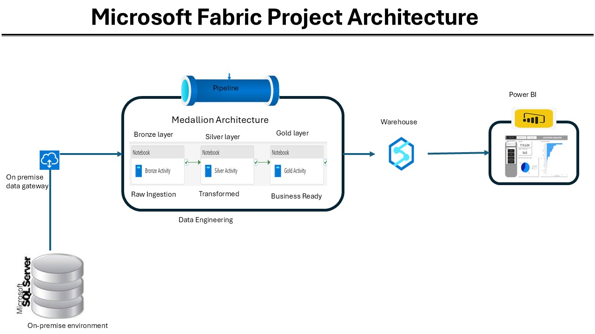
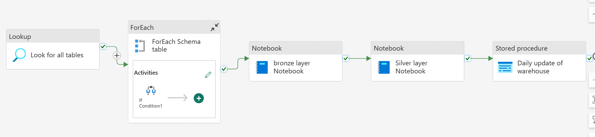
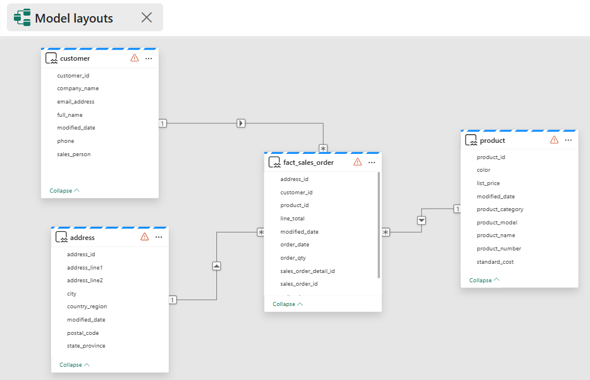

# **Transforming Enterprise Data Pipelines with Microsoft Fabric – A Scalable Solution for SQL Server Migration & Analytics**

## **1️⃣ Introduction & Objectives**
### **Project Overview**
This project demonstrates an **end-to-end data engineering pipeline** using **Microsoft Fabric** to automate the migration, transformation, and analysis of enterprise data from an **on-premises SQL Server database**. The goal is to create a **scalable, analytics-ready architecture** for structured reporting in **Power BI**.

### **Objectives**
✅ **Automate daily data ingestion** from SQL Server into Microsoft Fabric.  
✅ **Transform a highly normalized Snowflake Schema into a Star Schema** for optimized reporting.  
✅ **Implement a structured multi-layered data architecture** (Bronze, Silver, and Gold).  
✅ **Ensure data consistency and incremental updates** in the Fabric Warehouse.  
✅ **Create Power BI dashboards for real-time business insights.**  

---

## **2️⃣ Project Architecture & Workflow**

The project follows a **multi-layered architecture**:  

1️⃣ **Bronze Layer**: Raw data ingestion from on-prem SQL Server into Microsoft Fabric Lakehouse.  
2️⃣ **Silver Layer**: Data cleansing, transformations, and schema optimization.  
3️⃣ **Gold Layer (Fabric Warehouse)**: Star Schema implementation for analytics.  
4️⃣ **Power BI Reporting**: Interactive dashboards for business insights.  

### **🔹 Data Flow Diagram**
```
SQL Server → Fabric Pipelines → Lakehouse (Bronze) → Fabric Notebooks → Lakehouse (Silver) → Fabric Warehouse (Gold) → Power BI Dashboards
```
.

### **🔹 Pipeline Flow Diagram**
.
---

## **3️⃣ Data Ingestion (Bronze Layer)**
### **Process**
- **Data Source**: On-prem SQL Server .  
- **Fabric Pipelines**: Automates daily ingestion of tables into **Microsoft Fabric Lakehouse (Files section, Parquet format)**.
- **Data Storage**: Raw tables are stored in the **Bronze Layer** of the **Lakehouse**.

### **Key SQL Tables Ingested**
| Table Name | Description |
|------------|-------------|
| SalesOrderHeader | Contains sales order summary |
| SalesOrderDetail | Contains detailed sales transactions |
| Customer | Customer details |
| Product | Product details |
| ProductCategory | Product classification |
| ProductModel | Product model details |
| Address | Adress of customers |
| Cusomeraddress | Maps customer Id to Customer address info |
| Productdescription | Describes prodct items in details |
| ProductModelproductdescription | Product model details |

---

## **4️⃣ Data Transformation & Schema Optimization (Silver & Gold Layers)**

### **🔹 Silver Layer **
- Uses **Fabric Notebooks (Python)** for:   
  ✅ **Adjusting date columns to a standard "yyyy-MM-dd" format**.   
  ✅ **Saving the transformed tables to their respective directories in the "silver" layer** .   
  ✅ **Renaming column names to follow the snake_case naming convention**.   
  ✅ **Saving the transformed tables in Delta format**.   
  ✅ **Saving as lakehouse tables in the gold layer**.    
  [Tranformation 1](notebooks/Bronze_Notebook.ipynb).              
  [transformation 2](notebooks/Silver_Notebook_2.ipynb).   
  
### **🔹 Gold Layer (Star Schema in Fabric Warehouse)**
- **Denormalization** of Snowflake Schema into **Star Schema** for optimized queries using Views.
- **Fact & Dimension Tables** created in **Fabric Warehouse**.
- **storeprocedure to perform daily updates** .       
[SQL scripts](sql/)

#### **🔹 Fact Table: `fact_sales_order`**
| Column | Data Type | Description |
|---------|------------|-------------|
| sales_order_id | INT | Unique Order ID |
| sales_order_detail_id | INT | Unique order detail id |
| customer_id | INT | Foreign Key to Customer |
| product_id | INT | Foreign Key to Product |
| address_id | INT | Unique address ID | 
| order_qty | SMALLINT | Quantity ordered |
| unit_price | DECIMAL(18,2) | Sale price per unit |
| unit_price_discount | DECIMAL(38,18) | Unit price discount|
| line_total | DECIMAL(18,2) | Total transaction value |
| order_date | DATETIME2(3) | Order placement date |
| modified_date | VARCHAR(8000) | Last update timestamp |

#### **🔹 Dimension Table: `customer`**
| Column | Data Type | Description |
|---------|------------|-------------|
| customer_id | INT | Unique Customer ID |
| full_name | VARCHAR(255) | Customer full name |
| company_name | VARCHAR(255) | Company name |
| sales_person | varchar(8000) | Sales person |
| email_address | VARCHAR(255) | Email |
| phone | VARCHAR(50) | Contact number |
| modified_date | DATETIME2(3) | Last update timestamp |

#### **🔹 Dimension Table: `product`**
| Column | Data Type | Description |
|---------|------------|-------------|
| product_id | INT | Unique Product ID |
| product_name | VARCHAR(255) | Name of product |
| product_number | varchar(8000) | Product number |
| color | VARCHAR(8000) NULL | Product Color |
| product_category | VARCHAR(255) | Product category |
| standard_cost | DECIMAL(18,2) | Base production cost |
| list_price | DECIMAL(18,2) | Retail price |
| product_model | VARCHAR(8000) | Product model |
| modified_date | DATETIME2(3) | Last update timestamp |

#### **🔹 Dimension Table: `address`**
|---------|------------|-------------|
| Column | Data Type | Description |
| address_id | INT | Unique address ID |
| address_line1 | VARCHAR(255) | Address |
| address_line2 | VARCHAR(8000) | Address |
| city | VARCHAR(8000) | city  |
| state_province | VARCHAR(8000) | State province |
| country_region | VARCHAR(8000) | Country |
| postal_code | VARCHAR(8000) | Postal code |
| modified_date | VARCHAR(8000) | Last update timestamp |

### **🔹 Semantic model (Star schema) Diagram**   
.

---

## **5️⃣ Fabric Warehouse & Reporting**

### **Power BI Integration**
- **Direct Lake Mode** enables real-time reporting.  
- **Dashboards provide insights on:**  
  ✅ **Sales Trends** (Top-selling products, revenue breakdowns)     
  ✅ **Customer Analytics** (Repeat buyers, location-based insights)    
  ✅ **Inventory Performance**    

---

## **6️⃣ Key Technologies & Implementation Steps**
| **Technology** | **Purpose** |
|--------------|-------------|
| **Fabric Lakehouse** | Stores raw & transformed data |
| **Fabric Pipelines** | Automates data ingestion |
| **Fabric Notebooks** | Data cleansing & transformation |
| **Fabric Warehouse** | Stores Star Schema tables |
| **SQL Views & Stored Procedures** | Ensures data consistency |
| **Power BI** | Interactive reporting |

---

## **7️⃣ Results & Business Impact**
✅ **Fully automated daily data refresh** from SQL Server to Fabric.  
✅ **Optimized reporting queries with Star Schema in Fabric Warehouse**.  
✅ **Real-time analytics powered by Power BI dashboards**.  
✅ **Scalable architecture ready for enterprise adoption**.  

---
## **📌 How to Set Up the Project**

### **1️⃣ Set Up Microsoft Fabric Environment**
- Create a **Microsoft Fabric Lakehouse**.
- Create a **Fabric Warehouse** for structured analytics.
- Import **SQL scripts** into the **Fabric Warehouse**.
[SQL scripts](sql/).
- Deploy **Pipelines** to automate data ingestion.
[pipelines](pipelines/pipeline_file.json).

### **2️⃣ Execute Notebooks for Data Processing**
-Use **copy activity of pipeline** to ingest data into lakehouse.
- Run **bronze_layer.ipynb** process raw data ingested into silverlayer.
[bronze_layer](notebooks/Bronze_Notebook.ipynb).
- Run **Silver_Notebook_2.ipynb** silverlayer into gold layer.
[Silver_Notebook](notebooks/Silver_Notebook_2.ipynb).
- Run **views and storeprocedure** for schema transformation.
[StoredProcedures](sql/StoredProcedures/Update_Warehouse_Daily.sql).
[views](sql/Views/).

### **3️⃣ Load Data into Power BI**
- Open `Sales_report.pbix` in **Power BI Desktop**.
[Power BI Desktop](powerbi/).
- Connect to **Fabric Warehouse**.
- Refresh & publish the report.

## **📊 Expected Outcomes**
✅ **Automated SQL Server to Fabric Migration**.   
✅ **Optimized Star Schema for Faster Analytics**.   
✅ **Interactive Power BI Dashboards**.   
✅ **Scalable Solution for Enterprise Reporting**.   

## **📩 Contributions & Feedback**
Feel free to improve the project. Feedback is welcome!

## **📜 License**
This project is licensed under the **MIT License** – see `LICENSE` for details.

---
🚀 **Built with Microsoft Fabric for Next-Gen Data Analytics!**
---

## **8️⃣ Conclusion & Next Steps**
This project demonstrates the power of Microsoft Fabric in building modern, scalable data pipelines. Future enhancements may include:   
✅ Machine Learning Integration for predictive insights.   
✅ Automated Performance Monitoring & Cost Optimization.     

🚀 **This case study proves that Microsoft Fabric is the ultimate platform for seamless data engineering & analytics.**

